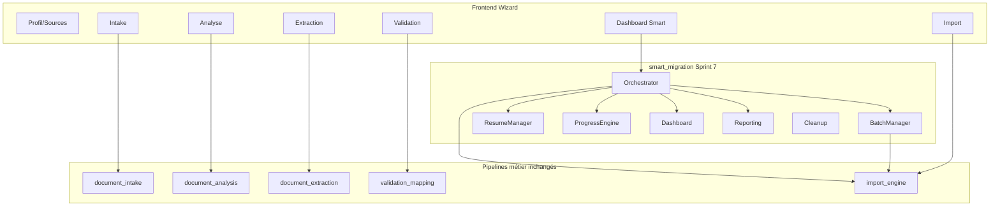

# Sprint 7 — Smart Migration & Enterprise Finalization

## Verdict

**MIGRATION CENTER V1 CERTIFIED**

## Objectif

Finaliser le Migration Center pour un usage Enterprise : orchestration, supervision, résilience, batch, reprise, reporting — **sans modifier** la logique métier des Sprints 1–6.

## Architecture finale

## Module

`backend/app/smart_migration/`

| Fichier | Rôle |
|---------|------|
| `orchestrator.py` | Coordination S2–S6 |
| `batch_manager.py` | Lots, workers, cancel, restart |
| `resume_manager.py` | Reprise post-crash |
| `progress_engine.py` | Progression **serveur** |
| `scheduler.py` | Exécution séquentielle des lots |
| `dashboard.py` | KPIs temps réel |
| `reporting.py` | JSON / CSV / PDF versionnés |
| `metrics.py` | Métriques + Prometheus registry |
| `cleanup.py` | Archivage / purge avec confirmation |
| `events.py` | Events migration.* |
| `api/routes.py` | `/api/migration` |

## API `/api/migration`

| Méthode | Endpoint |
|---------|----------|
| GET | `/status` |
| GET | `/dashboard` |
| GET | `/metrics` |
| GET | `/report` |
| POST | `/start` |
| POST | `/resume` |
| POST | `/cancel` |
| POST | `/retry_failed` |
| POST | `/restart_batch` |
| POST | `/cleanup` |

Distinct de `/api/migrations` (sessions wizard Sprint 1).

## Permissions

`smart_migration.read|run|cancel|resume|report|cleanup`

## Events

`migration.started.v1` · `migration.progress.v1` · `migration.completed.v1` · `migration.failed.v1` · `migration.cancelled.v1` · `migration.resumed.v1` · `migration.report.ready.v1`

## Frontend

- `MigrationDashboard` — étape wizard 8 (Terminé)
- Graphique, lots, ETA, coûts, téléchargement rapport JSON/CSV/PDF
- Polling 5s (données calculées côté serveur)

## PostgreSQL

`sql/elfis_smart_migration_sprint7_postgres.sql`  
Cert : `docs/migration/sprint7-postgres-certification.json` → `certified: true`

## Preuves

| Contrôle | Résultat |
|----------|----------|
| Tests S7 | 6 PASS |
| Régression S5+S6 | 12 PASS (total 18) |
| Tests FE | 2 PASS |
| Build FE | OK |
| Routes API | **405** |
| PG Sprint 7 | certified |
| Batch 100 / 1000 simulés | PASS |
| Resume / cancel / retry | PASS |
| Cleanup confirmation | PASS |

## Matrice globale

Voir `migration-center-v1-final-matrix.md`
